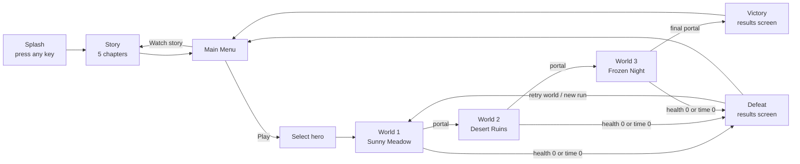
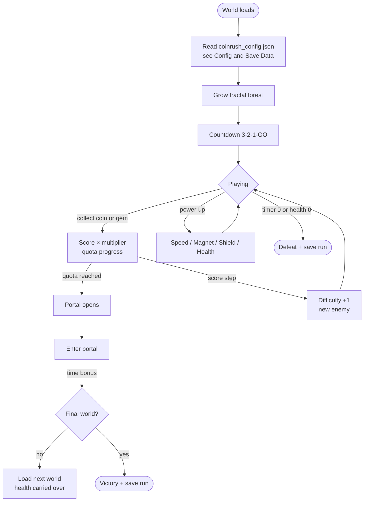

# Game Loop
Back to [[00 Coin Rush Design Index]]

## Scene flow

```mermaid
flowchart LR
    Splash[Splash<br/>press any key] --> Story[Story<br/>5 chapters]
    Story --> Menu[Main Menu]
    Menu -->|Play| Select[Select hero]
    Select --> W1[World 1<br/>Sunny Meadow]
    W1 -->|portal| W2[World 2<br/>Desert Ruins]
    W2 -->|portal| W3[World 3<br/>Frozen Night]
    W3 -->|final portal| Win[Victory<br/>results screen]
    W1 & W2 & W3 -->|health 0 or time 0| Lose[Defeat<br/>results screen]
    Win --> Menu
    Lose -->|retry world / new run| W1
    Lose --> Menu
    Menu -->|Watch story| Story
```

## Inside one world

```mermaid
flowchart TD
    Start([World loads]) --> Cfg[Read coinrush_config.json<br/>see Config and Save Data]
    Cfg --> Trees[Grow fractal forest]
    Trees --> CD[Countdown 3-2-1-GO]
    CD --> Play{Playing}
    Play -->|collect coin or gem| Score[Score × multiplier<br/>quota progress]
    Score -->|quota reached| Portal[Portal opens]
    Score -->|score step| Diff[Difficulty +1<br/>new enemy]
    Diff --> Play
    Play -->|power-up| PU[Speed / Magnet / Shield / Health]
    PU --> Play
    Portal --> Enter[Enter portal]
    Enter -->|time bonus| Next{Final world?}
    Next -->|no| Load[Load next world<br/>health carried over]
    Next -->|yes| Won([Victory + save run])
    Play -->|timer 0 or health 0| Lost([Defeat + save run])
```

Related: [[Game State Machine]], [[Scoring and Combo]]
